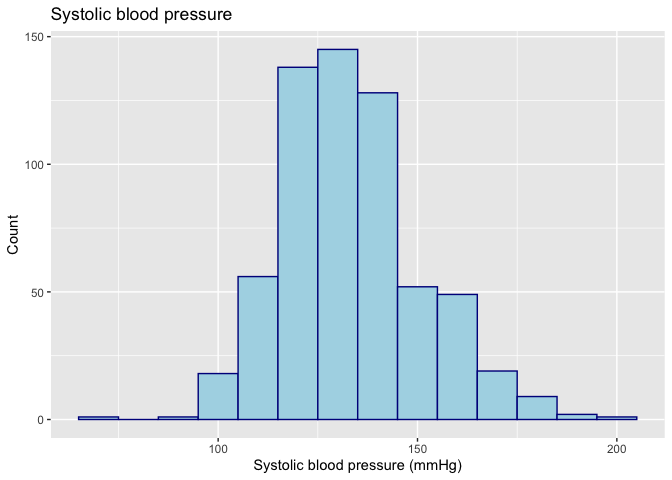
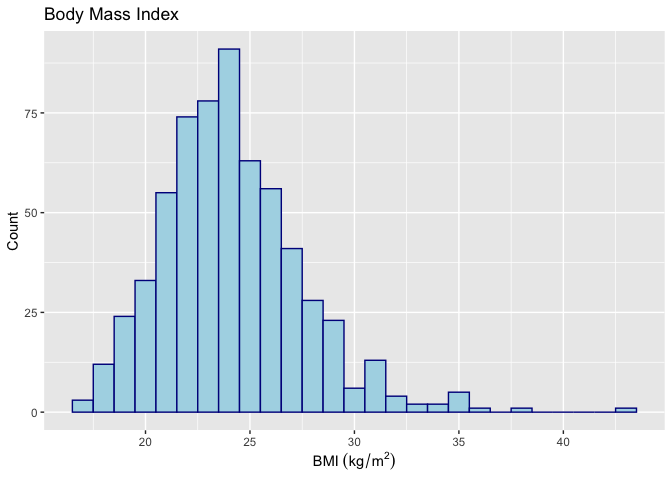
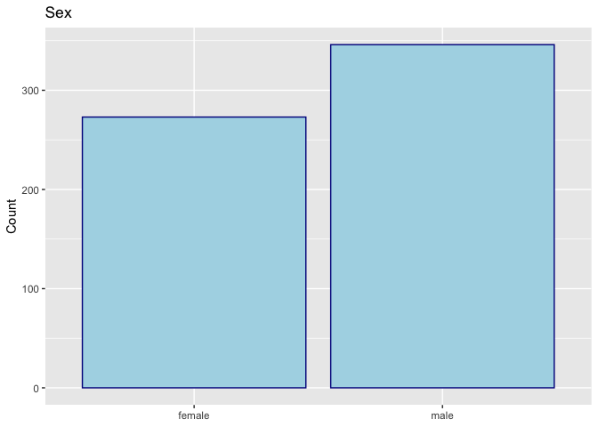
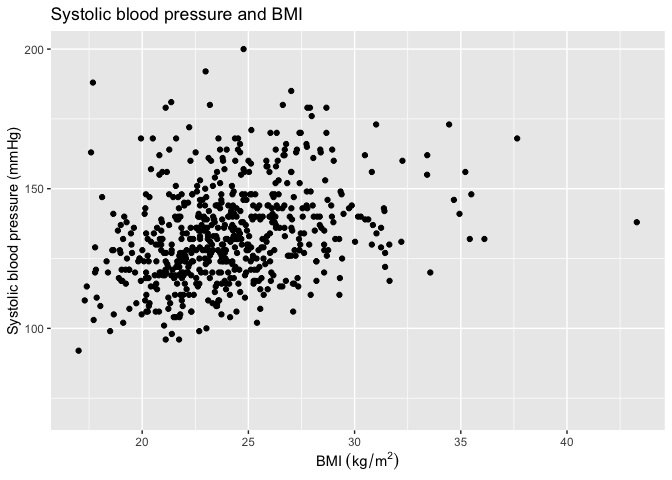
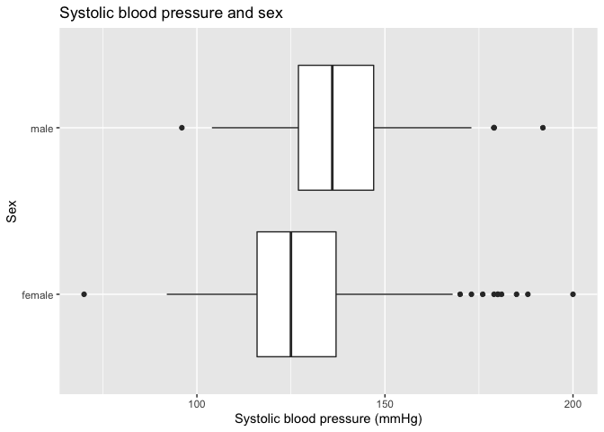
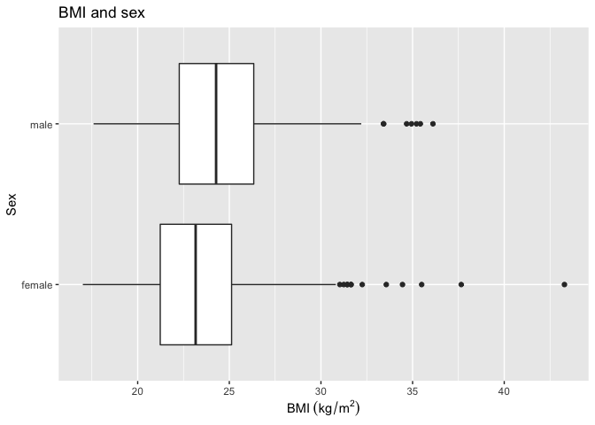
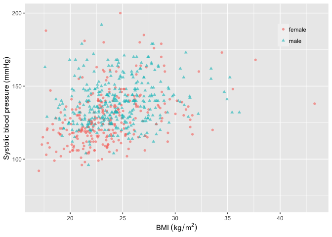

HDAT 9600 Team Based Learning Activity
================
Mark Hanly
21 Feb 2022

### Housekeeping

1.  📸 Cameras and recording

2.  ❓ Tutorial questions: names list

3.  👥 Team formation and communication
    
      - There is a Discussion feature in GitHub. Visible to class admin
        FYI.
      - Welcome to set up private Teams group or use other platforms.
      - Need to think about how to handle collaboration on shared
        project (Git commit example)

4.  💻 Tutorial packages
    
      - Deployed online
      - Accessible locally
      - Source code on GitHub

-----

### TBLA Submissions

#### 🚀 Highlights

  - Updating title info (e.g. authors/dates)  
  - Everyone embraced ggplot, lots of nice use of colour\! 💹
  - Sensible graph choices.
  - Using units of measurement; sensible and consistent choice for
    number of decimal places.

> Weight ranged from 32.2kg to 117.0kg, with a median weight of 69.5kg
> and inter-quartile range of 61.0 to 78.6kg.

> Age ranged from 16 to 80 years, with a median of 39 years and
> inter-quartile range of 28 to 49 years.

  - Please never say (for example) weight was 70.34522. That level of
    precision is meaningless, and makes it more difficult to digest.

  - Using absolute and relative frequencies to summarise data.

> There were 434 non-smokers and 185 smokers in the data set out of 619
> people. About 30% of the population in the data set were the smokers.

#### ⛰ Opportunities to improve

  - Make sure to read the instructions carefully\! (e.g. “Delete this in
    your submission” instruction)  
  - Output with no comments  
  - Output where \*\*formatting has failed\_
  - Mindful of missing data, e.g. cholesterol missing 266 observations

-----

### Overview

The three key variables I will select are

1.  Systolic blood pressure (`systol`)
2.  Body Mass index (`bmi`)
3.  Sex (`sex`)

Below I examine the univariate distribution for each variable and the
three bivariate relationships.

### Univariate analysis

#### Systolic blood pressure

    ##    Min. 1st Qu.  Median    Mean 3rd Qu.    Max. 
    ##    70.0   121.0   132.0   133.6   143.0   200.0

<!-- -->

**Interpretation:**  
Systolic blood pressure is normally distributed with a with a median of
132 mmHg and inter-quartile range of 121 to 143 mmHg and a range from 70
to 200 mmHg.

#### BMI

    ##    Min. 1st Qu.  Median    Mean 3rd Qu.    Max.    NA's 
    ##   17.01   21.85   23.78   24.15   26.04   43.29       3

<!-- -->

**Interpretation:**  
Body mass index was approximately normally distributed with a mean of
24.2 kg/m2 and an interquartile range of 21.8 - 26.0
kg/m2. There was a long right tail with a range from 17.0 -
43.3 kg/m2. The records were missing information on BMI.

#### Sex

    ## 
    ## female   male 
    ##    273    346

    ## 
    ##    female      male 
    ## 0.4410339 0.5589661

<!-- -->

**Interpretation:**  
The dataset included 273 women (44%) and 346 men (56%).

-----

### Bivariate analyses

#### Systolic blood pressure and BMI

<!-- -->
**Interpretation:**  
There appears to be a slight positive association between systolic blood
pressure and BMI. The correlation between the two variables was 0.31.

#### Systolic blood pressure and sex

<!-- -->

**Interpretation:**

The men in this sample had slightly higher blood pressure (138 mmHg on
average) compared to women (128 mmHg on average).

#### Sex and BMI

<!-- -->

**Interpretation:**

The men in this sample had slightly higher BMI (24.5 kg/m2 on
average) compared to women (23.7 kg/m2 on average).

-----

### Multivariate summary

<!-- -->

**Interpretation:**  
There appears to be a positive relationship between BMI and systolic
blood pressure for both men and women, although men tend to have a
higher BMI overall.

-----

## Resources

### Different types of bivariate analysis

From this medium.com blogpost by [Ayobami
Akiode](https://ayobamiakiode.medium.com/)

### Measuring association for different combination of variable types

see <https://www.statisticssolutions.com/levels-of-measurement/>

### Choice of visualisation for different combination of variable types

See the [ggplot2
cheatsheet](https://www.maths.usyd.edu.au/u/UG/SM/STAT3022/r/current/Misc/data-visualization-2.1.pdf)
for inspiration
